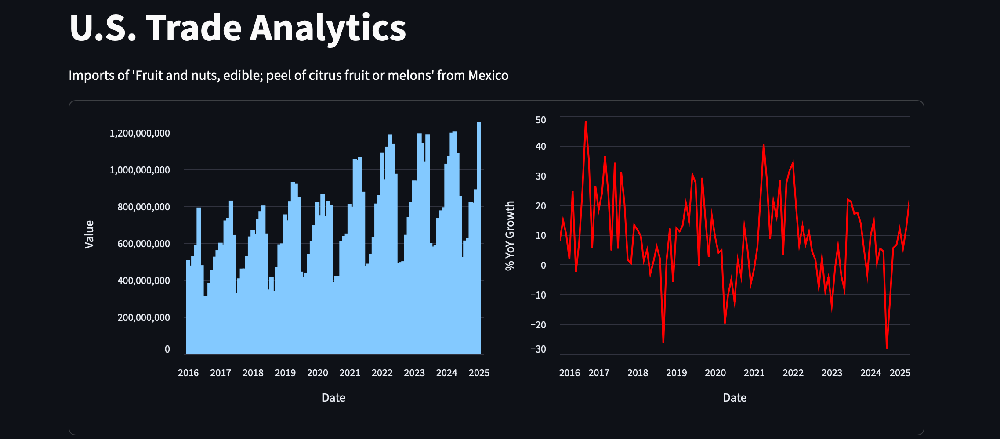
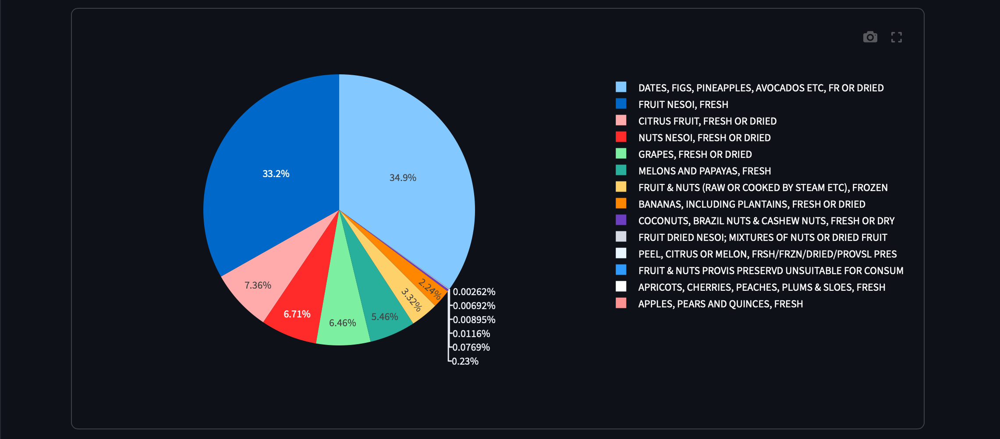
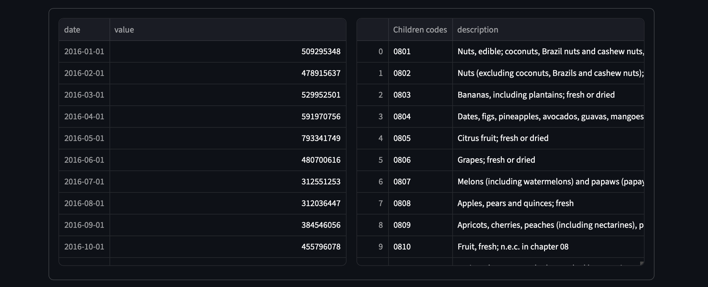
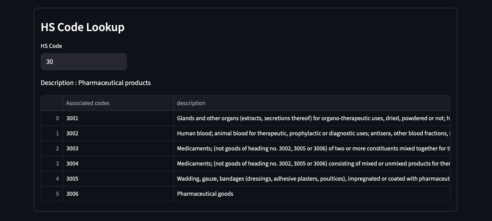

# USTrade Dashboard

This dashboard allows for quick analysis and data downloads from the U.S. Census Bureau HTTP API.

The application is available at : [https://ustrade.streamlit.app](https://ustrade.streamlit.app).

It relies on the the `ustrade` library. For more details, see the [original repository](https://github.com/fantinsib/ustrade).

## Usage

The left-hand panel allows users to select:
- a trade flow (imports or exports),
- a country (name, official code, or ISO2 code),
- an HS product code,
- a beginning and end date (data is available from 2011-01 onward).

***

The first two charts show the evolution of import/export values for the selected product, both in absolute terms and as a year-over-year (YoY) percentage change.

***

The third chart decomposes the selected HS code flow into its child codes, showing the contribution of each sub-category.

***

Data can be downloaded as CSV files directly from the application.

***

The HS code lookup panel allows users to search for and explore HS codes and their descriptions.

## Contributing

Contributions are welcome. Feel free to open an issue or submit a pull request if you find bugs or have suggestions for improvements
